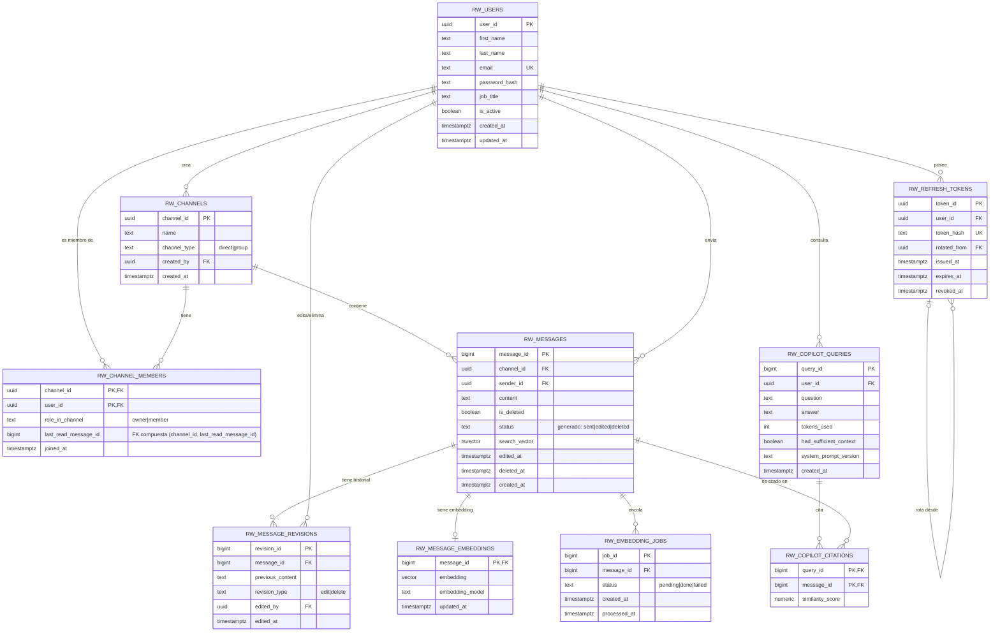

# Modelo de Datos — Plataforma de Mensajería Interna (Riwi Co.)

Fase 1 del ciclo de vida (Spec-Driven Development). Este documento es la **especificación** que gobierna el DDL de la Fase 2. Toda tabla, FK, índice o CHECK del DDL debe trazarse a una decisión tomada aquí.

## 1. Entidades y reglas de negocio implícitas (derivadas del corpus `seed.json`)

Analizando el corpus de `seed.json` (usuarios, canales y mensajes de ejemplo de Riwi Co.) se identifican las siguientes entidades y reglas de negocio implícitas:

- Un **usuario** tiene nombre, correo único, contraseña (hash), cargo ("cargo") y puede estar activo o inactivo. El copiloto debe conocer nombre y cargo del actor autenticado.
- Un **canal** agrupa una conversación; puede ser directo (2 participantes) o grupal (N participantes). Un canal tiene exactamente un creador.
- La **membresía** a un canal es lo único que determina si un usuario puede leer/buscar/consultar (vía copiloto) los mensajes de ese canal — es la base de la política RLS.
- Un **mensaje** pertenece a exactamente un canal y tiene exactamente un remitente, que debe ser miembro del canal en el momento del envío.
- Un mensaje puede **editarse** o **eliminarse**, pero nunca se borra físicamente: se marca `is_deleted` y se conserva el contenido original en un historial de revisiones, de forma que un fallo a mitad de la operación no deje al mensaje en un estado inconsistente (todo ocurre dentro de una función transaccional).
- El **estado de lectura** por canal se modela como "último mensaje leído" por miembro (no una fila por mensaje×usuario): es información suficiente para saber qué está pendiente de leer y evita una tabla que crece de forma innecesaria (O(mensajes×miembros)). Para que ese puntero no pueda apuntar a un mensaje de **otro** canal, `rw_messages` declara `UNIQUE (channel_id, message_id)` y `rw_channel_members.last_read_message_id` se referencia mediante una **FK compuesta** `(channel_id, last_read_message_id) → rw_messages(channel_id, message_id)` — el propio motor rechaza la fila si el mensaje no pertenece al canal de la membresía, sin necesitar un trigger de validación aparte.
- Los estados **pendiente/enviado/fallido** de un mensaje son estados transitorios de UI (envío optimista en el frontend): un mensaje que falla al enviarse nunca llega a persistirse en `rw_messages`. En base de datos el estado del mensaje (`sent`/`edited`/`deleted`) **no se guarda como columna independiente**: se deriva siempre de `is_deleted` y `edited_at` mediante una columna generada (`GENERATED ALWAYS AS ... STORED`), para que nunca puedan desincronizarse entre sí (ver §2 y §4).
- El **vector de búsqueda** (`tsvector`) de cada mensaje debe mantenerse consistente automáticamente vía trigger cuando cambia el contenido — esto resuelve el requisito de búsqueda con resaltado (Consulta 2).
- El **embedding** (para RAG) es un proceso distinto: se calcula de forma asíncrona (llamada a un proveedor externo de IA), por lo que el trigger de base de datos no lo calcula directamente — en su lugar encola un job (`rw_embedding_jobs`, patrón *outbox*) que el backend procesa. Esto evita acoplar la base de datos a una llamada HTTP externa dentro de una transacción.
- Toda consulta al **copiloto** debe quedar registrada (para el requisito "consumo acumulado del copiloto por usuario") junto con las citas a los mensajes fuente que usó para responder — y solo puede citar mensajes de canales donde el usuario es miembro.
- El **refresh token** nunca se guarda en texto plano (solo su hash) y cada uso genera una rotación, encadenada mediante autorreferencia, para poder detectar reintentos de un token ya rotado (señal de robo de token).

## 2. Diagrama Entidad-Relación

Renderizado: [`er-diagram.png`](./er-diagram.png).



## 3. Justificación del tipo de clave por entidad

| Entidad | Tipo de PK | Justificación |
|---|---|---|
| `rw_users`, `rw_channels`, `rw_refresh_tokens` | `UUID` (v4, `gen_random_uuid()`) | Identificadores expuestos externamente (JWT `sub`, URLs de API, referencias en frontend). Un UUID no es enumerable/adivinable — mitiga IDOR — a diferencia de un serial incremental. |
| `rw_messages`, `rw_message_revisions`, `rw_embedding_jobs`, `rw_copilot_queries` | `BIGINT GENERATED ALWAYS AS IDENTITY` | Son entidades de alto volumen internas. Un identificador monótono creciente es exactamente lo que necesita la **paginación por keyset** (`WHERE message_id < :cursor ORDER BY message_id DESC`) sin necesitar un cursor compuesto, y ocupa la mitad del espacio de índice que un UUID. No se exponen para enumeración de otros recursos sensibles (el acceso siempre se filtra primero por `channel_id` + membresía vía RLS). |
| `rw_channel_members`, `rw_copilot_citations` | Clave primaria compuesta (natural) | Son tablas puente puras: la combinación de FKs ya es única por definición de negocio (un usuario es miembro de un canal una sola vez; una cita relaciona una consulta con un mensaje una sola vez). Un surrogate key añadiría una columna sin valor de negocio. |
| `rw_message_embeddings` | `message_id` (mismo PK que `rw_messages`, relación 1:1) | Evita un surrogate innecesario en una relación estrictamente 1:1 dependiente del ciclo de vida del mensaje. |

## 4. Normalización

**1FN (atomicidad):** todos los atributos son escalares. No se almacenan listas/CSV (p. ej. no hay una columna `read_by_user_ids` con múltiples valores; en su lugar `rw_channel_members.last_read_message_id` da el estado de lectura por fila). El contenido del mensaje es un único valor de texto, no una estructura anidada.

**2FN (sin dependencias parciales):** en las tablas con clave compuesta (`rw_channel_members`, `rw_copilot_citations`) todo atributo no clave depende de **la clave compuesta completa**, no de una parte:
- `role_in_channel` y `last_read_message_id` dependen del par (`channel_id`,`user_id`) completo — no tiene sentido sin ambos.
- `similarity_score` depende del par (`query_id`,`message_id`) completo.

**3FN (sin dependencias transitivas):** ningún atributo no clave depende de otro atributo no clave.
- `rw_messages` **no** almacena `sender_name`, `sender_job_title` ni `channel_name` (estarían transitivamente determinados vía `sender_id`/`channel_id` → `rw_users`/`rw_channels`). Se obtienen siempre por join o por la vista de conversaciones (Fase 3).
- `rw_copilot_queries` no almacena el nombre/cargo del usuario; se resuelve desde `rw_users` vía `user_id` en el momento de construir el contexto del copiloto (requisito: "construyendo ese contexto en el servidor desde el token").
- `rw_message_embeddings` separa el vector del contenido textual: el modelo de embedding (`embedding_model`) es metadato del propio vector, no del mensaje.
- `rw_messages.status` **no es una columna almacenada independiente**: sería un dato derivable de `is_deleted`/`edited_at` y guardarlo aparte abriría la puerta a que ambos se desincronicen (p. ej. un `UPDATE` que marque `status='deleted'` sin tocar `is_deleted`). Se define como columna **generada** (`GENERATED ALWAYS AS (CASE WHEN is_deleted THEN 'deleted' WHEN edited_at IS NOT NULL THEN 'edited' ELSE 'sent' END) STORED`), calculada siempre por PostgreSQL a partir de las columnas fuente — nunca puede quedar inconsistente.

## 5. FKs y estrategia `ON DELETE` (se implementa en Fase 2, justificada aquí)

| FK | ON DELETE | Justificación |
|---|---|---|
| `rw_channels.created_by → rw_users` | `RESTRICT` | Nunca se borra físicamente un usuario (solo `is_active=false` vía procedimiento); un canal siempre debe tener un creador trazable. |
| `rw_channel_members.channel_id → rw_channels` | `CASCADE` | La membresía no tiene sentido sin el canal; fuera de MVP no se expone borrado de canales, pero el modelo queda correcto si se agrega. |
| `rw_channel_members.user_id → rw_users` | `RESTRICT` | Igual que arriba: los usuarios no se borran físicamente, se desactivan. |
| `rw_channel_members.(channel_id, last_read_message_id) → rw_messages(channel_id, message_id)` | `SET NULL` | FK **compuesta** contra la `UNIQUE (channel_id, message_id)` de `rw_messages`: garantiza en el propio motor que el "último leído" pertenece al mismo canal de la membresía; si el mensaje se re-referenciara de forma inválida, la fila se rechaza en vez de corromper el estado de lectura. |
| `rw_messages.channel_id → rw_channels` | `RESTRICT` | Un canal con mensajes no puede eliminarse en MVP (evita pérdida accidental de historial). |
| `rw_messages.sender_id → rw_users` | `RESTRICT` | Preserva la autoría del mensaje aunque el usuario se desactive. |
| `rw_message_revisions.message_id → rw_messages` | `CASCADE` | El historial de revisiones no tiene sentido sin el mensaje (aunque el mensaje en sí nunca se borra físicamente, la FK debe declararse consistente). |
| `rw_message_embeddings.message_id → rw_messages` | `CASCADE` | Relación 1:1 dependiente. |
| `rw_embedding_jobs.message_id → rw_messages` | `CASCADE` | El job pierde sentido si el mensaje desaparece. |
| `rw_refresh_tokens.user_id → rw_users` | `CASCADE` | Los tokens son un artefacto de sesión, no un registro de negocio a preservar. |
| `rw_refresh_tokens.rotated_from → rw_refresh_tokens` | `SET NULL` | Permite romper la cadena de rotación sin perder el token actual si el predecesor se purga. |
| `rw_copilot_queries.user_id → rw_users` | `RESTRICT` | Se conserva el consumo histórico del copiloto (Consulta 4) aunque el usuario se desactive. |
| `rw_copilot_citations.query_id → rw_copilot_queries` | `CASCADE` | Las citas no existen sin la consulta que las generó. |
| `rw_copilot_citations.message_id → rw_messages` | `RESTRICT` | Una cita debe seguir siendo verificable; como los mensajes nunca se borran físicamente, esta FK siempre es resoluble. |

## 6. Índice único parcial (requisito explícito)

```sql
CREATE UNIQUE INDEX ux_embedding_jobs_pending_per_message
  ON rw_embedding_jobs (message_id)
  WHERE status = 'pending';
```
Evita encolar dos jobs de re-embedding simultáneos para el mismo mensaje (patrón *outbox* sin duplicados en vuelo), sin restringir el histórico de jobs `done`/`failed`.
